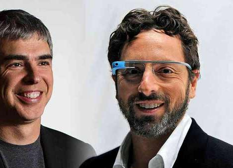
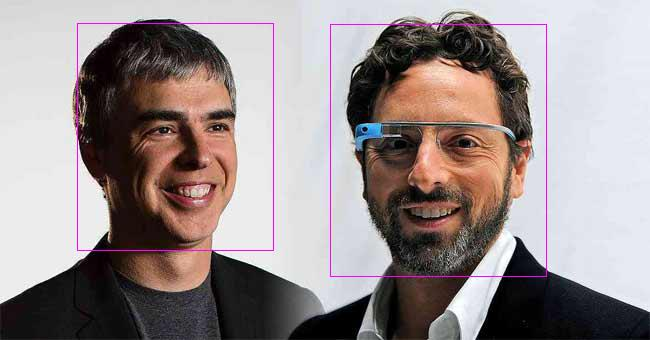
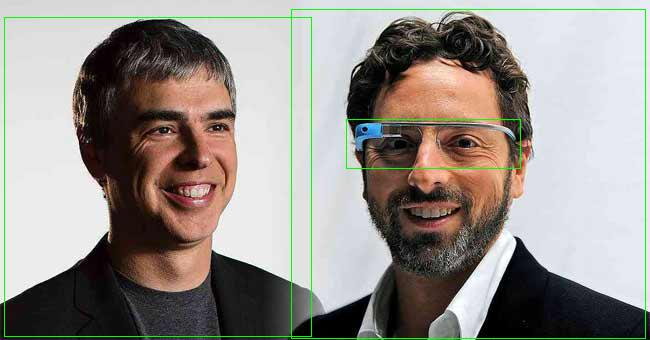
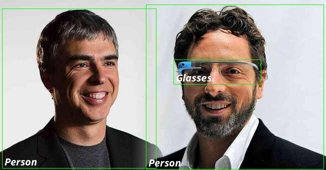

<div align="center">
  

[](https://packagist.org/packages/ahmadmayahi/php-google-vision)
[](https://packagist.org/packages/ahmadmayahi/php-google-vision)
[](https://codecov.io/gh/ahmadmayahi/php-google-vision)
[](https://codeclimate.com/github/ahmadmayahi/php-google-vision/maintainability)
[](https://scrutinizer-ci.com/g/ahmadmayahi/php-google-vision/?branch=main)
[](https://github.com/ahmadmayahi/php-google-vision/actions/workflows/run-tests.yml)
[](https://github.com/ahmadmayahi/php-google-vision/actions?query=workflow%3A"Check+%26+fix+styling"+branch%main)
</div>

## STILL IN ACTIVE DEVELOPMENT - DO NOT USE IN PRODUCTION

**Requires PHP 8.0+**

For feedback, please [contact me](https://form.jotform.com/201892949858375).


This package provides an elegant wrapper around [Google Vision API](https://github.com/googleapis/google-cloud-php-vision) and more.

It's an effort to make Google Vision API easy and fun to work with.

# Contents

- [Installation](#installation)
- [Creating Google Service Account](#creating-google-service-account)
- [Configuration](#configuration)
- [Original Responses](#original-responses)
- [Integration with Laravel](#integration-with-laravel)
- [Image Text Detection](#image-text-detection)
    - [Get Plain Text](#get-plain-text)
    - [Get Document](#get-document)
    - [Handwriting](#handwriting)
    - [PDF and Tiff](#pdf-and-tiff)
- [Crop Hints Detection](#crop-hints-detection)
  - [Detect Crop Hints](#detect-crop-hints) 
  - [Draw box around hints](#draw-box-around-hints) 
  - [Crop Image](#crop-image) 
- [Face Detection](#face-detection)
    - [Draw box around faces](#draw-box-around-faces)
- [Detect Image Properties](#image-properties-detection)
- [Label Detection](#label-detection)
- [Landmark Detection](#landmark-detection)
- [Logo Detection](#logo-detection)
- [Object Localizer](#object-localizer)
    - [Detect Objects](#detect-objects)
    - [Draw Box Around Objects](#draw-box-around-objects)
    - [Draw Box Around Objects With Text](#draw-box-around-objects-with-text)
- [Web Detection](#web-detection)

## Installation

You may install the package via composer:

```bash
composer require ahmadmayahi/php-google-vision
```

## Creating Google Service Account

First, you must [create a Google service account](https://cloud.google.com/iam/docs/creating-managing-service-accounts) and setup the configuration object.

## Configuration

```php
use AhmadMayahi\Vision\Config;

$config = (new Config())
    // Required: path to your google service account.
    ->setCredentials('path/to/google-service-account.json')

    // Optional: defaults to `sys_get_temp_dir()`
    ->setTempDirPath();
```

## Original Responses

All the features come with `getOriginalResponse()` method which returns the original response that's returned by [PHP Google Vision Package](https://github.com/googleapis/google-cloud-php-vision).

You may get the original response for any feature as follows:

```php
use AhmadMayahi\Vision\Vision;

$response = Vision::init($config)
    ->file('/path/to/input/file.jpg')
    ->faceDetection()
    ->getOriginalResponse();
```

Depending on the feature, the response type might vary, here is a list of all the response types:

|Feature|Response Type|
|---|---|
|`faceDetection`|`Google\Protobuf\Internal\RepeatedField` contains `Google\Cloud\Vision\V1\FaceAnnotation`|
|`imageTextDetection`|`Google\Protobuf\Internal\RepeatedField` contains `Google\Cloud\Vision\V1\EntityAnnotation `|
|`imagePropertiesDetection`|`Google\Cloud\Vision\V1\ImageProperties`|
|`labelDetection`|`Google\Protobuf\Internal\RepeatedField` contains `Google\Cloud\Vision\V1\AnnotateImageResponse`|
|`landmarkDetection`|`Google\Protobuf\Internal\RepeatedField` contains `Google\Cloud\Vision\V1\AnnotateImageResponse`|
|`logoDetection`|`Google\Protobuf\Internal\RepeatedField` contains `Google\Cloud\Vision\V1\AnnotateImageResponse`|
|`objectLocalizer`|`Google\Protobuf\Internal\RepeatedField` contains `Google\Cloud\Vision\V1\AnnotateImageResponse`|
|`safeSearchDetection`|`Google\Cloud\Vision\V1\SafeSearchAnnotation`contains `Google\Cloud\Vision\V1\AnnotateImageResponse`|

The `file()` method accepts the following types:

- Local file path: `path/to/your/file`.
- Google Storage path: `gs://path/to/file`.
- File resource, such as `fopen()`.
- `SplFileInfo`.
- `SplFileObject`.

## Integration with Laravel

Open up the `AppServiceProvider` and add the following lines:

```php
use AhmadMayahi\Vision\Vision;
use AhmadMayahi\Vision\Config;

public function register()
{
    $this->app->singleton(Vision::class, function ($app) {
        $config = (new Config())
            ->setCredentials(config('vision.service_account_path'));
    
        return Vision::init($config);
    });
}
```

Using Dependency Injection:

```php
use AhmadMayahi\Vision\Vision;
use Illuminate\Http\Request;

class FaceDetectionController
{
    public function detect(Request $request, Vision $vision)
    {
        $vision = $vision
            ->file($request->face_file->path())
            ->faceDetection()
            ->detect();
            
        // ...
    }
}
```

You may also resolve the object using the `app` helper as follows:

```php
use AhmadMayahi\Vision\Vision;

/** @var Vision $vision */
$vision = app(Vision::class);

$result = $vision
    ->file('path/to/file')
    ->faceDetection()
    ->detect();

// ...
```

## Image Text Detection (OCR)

### Get plain text

The `plain()` method returns an object of type `AhmadMayahi\Vision\Data\ImageText`.

```php
use AhmadMayahi\Vision\Vision;

$response = Vision::init($config)
    ->file('/path/to/input/image.jpg')
    ->imageTextDetection()
    ->plain();

$response->locale; // locale, for example "en"
$response->text;   // Image text
```

You may also get the plain text using `__toString()` magic method:

```php
echo $response;
```

### Get Document

The `getDocument` returns an object of type `AhmadMayahi\Vision\Data\ImageText`.

```php
use AhmadMayahi\Vision\Vision;

$response = Vision::init($config)
    ->file('/path/to/input/image.jpg')
    ->imageTextDetection()
    ->document();
 
$response->locale; // locale, for example "en" for English
$response->text;   // Image text
```

> The difference between `plain()` and `docuemnt()` is that the first one only retrieves the plain text (no bullets, signs, etc...), whereas the latter one tries to retrieve the entire document (including bullets, symbols, etc...).

### Handwriting
The `document` method can also be used to detect handwriting in an image.

### PDF and Tiff
Coming soon.

## Crop Hints Detection
[Crop Hints](https://cloud.google.com/vision/docs/detecting-crop-hints) suggests vertices for a crop region on an image.

### Detect Crop Hints
```php
use AhmadMayahi\Vision\Vision;

$response = Vision::init($config)
    ->file('/path/to/input/image.jpg')
    ->cropHintsDetection()
    ->detect();

/** @var \AhmadMayahi\Vision\Data\CropHints $item */
foreach ($response as $item) {
    $item->bounds; // An array of \AhmadMayahi\Vision\Data\Vertex

    $item->confidence;

    $item->importanceFraction;    
}
```

### Draw box around hints
You may use the `drawBoxAroundHints` method as follows:
```php
use AhmadMayahi\Vision\Vision;
use AhmadMayahi\Vision\Enums\Color;

Vision::init($config)
    ->file('/path/to/input/image.jpg')
    ->cropHintsDetection()
    ->drawBoxAroundHints(Color::GREEN)
    ->toJpeg('out.jpg')
```


### Crop Image
You may export the cropped image as follows:

```php
use AhmadMayahi\Vision\Vision;

$response = Vision::init($config)
    ->file('/path/to/input/image.jpg')
    ->cropHintsDetection()
    ->crop()
    ->toJpeg('out.jpg');
```

Original Image:


Cropped Image:



## Face Detection

[Face Detection](https://cloud.google.com/vision/docs/detecting-faces) detects multiple faces within an image along with the associated key facial attributes such as emotional state or `wearing headwear`.

The `detect` method returns a `Generator` of `AhmadMayahi\Vision\Data\Face`:

```php
use AhmadMayahi\Vision\Vision;

$vision = Vision::init($config);

$faces = $vision
    ->file('/path/to/image.jpg')
    ->faceDetection()
    ->detect();

echo count($faces). ' faces found';

/** @var \AhmadMayahi\Vision\Data\Face $faceData */
foreach ($faces as $faceData) {
    $faceData->anger;
    
    $faceData->surprise;
    
    $faceData->joy;

    $faceData->blurred;
    
    $faceData->headwear;

    $faceData->landmarking;

    $faceData->underExposes;
    
    $faceData->detectionConfidence;
    
    $faceData->bounds;
}
```

> `anger`, `surprise` and `joy` etc... return Likelihoods ratings which are expressed as six different values: `UNKNOWN`, `VERY_UNLIKELY`, `UNLIKELY`, `POSSIBLE`, `LIKELY`, or `VERY_LIKELY`.
> See [Likelihood](https://cloud.google.com/vision/docs/reference/rpc/google.cloud.vision.v1#likelihood).

Get the `detect` method as array:
```php
$faces = $vision
    ->file('/path/to/image.jpg')
    ->faceDetection()
    ->asArray();
```

Get the `detect` method as JSON:
```php
$faces = $vision
    ->file('/path/to/image.jpg')
    ->faceDetection()
    ->asJson();
```

### Draw box around faces

```php
use AhmadMayahi\Vision\Vision;
use AhmadMayahi\Vision\Enums\Color;

$analyzer = Vision::init($config)
    ->file('/path/to/input/image.jpg')
    ->faceDetection()
    ->drawBoxAroundFaces(Color::MAGENTA)
    ->toJpeg('faces.jpg');
```

> Alternatively, you may use `toPng`, `toGif`, `toBmp` methods.
> All the drawing methods return an object of type `AhmadMayahi\Vision\Utils\Image`.



> This feature doesn't support Google Storage yet.

## Image Properties Detection

The [Image Properties](https://cloud.google.com/vision/docs/detecting-properties) feature detects general attributes of the image, such as dominant color.

The `detect` method returns a `Generator` of `AhmadMayahi\Vision\Data\ImagePropertiesData`:

```php
use AhmadMayahi\Vision\Vision;

$properties = Vision::init($config)
    ->file('/path/to/input/image.jpg')
    ->imagePropertiesDetection()
    ->detect();

/** @var \AhmadMayahi\Vision\Data\ImageProperties $item */
foreach ($properties as $item) {
    $item->red;

    $item->blue;

    $item->green;

    $item->pixelFraction;    
}
```

## Landmark Detection

[Landmark Detection](https://cloud.google.com/vision/docs/detecting-landmarks) detects popular natural and human-made structures within an image.

```php
use AhmadMayahi\Vision\Vision;

$landmarks = Vision::init($config)
    ->file('/path/to/baghdad.jpg')
    ->landmarkDetection()
    ->detect();

/** @var \AhmadMayahi\Vision\Data\Landmark $landmark */
foreach ($landmarks as $landmark) {
    $landmark->name;
    
    // An array containing the detected locations in latitude/longitude format.
    $landmark->locations;
}
```

## Safe Search Detection

[SafeSearch Detection](https://cloud.google.com/vision/docs/detecting-safe-search) detects explicit content such as adult content or violent content within an image.

The `detect` method returns an object of type `AhmadMayahi\Vision\Data\SafeSearch`:

```php
use AhmadMayahi\Vision\Vision;

$result = Vision::init($config)
    ->file('/path/to/input/image.jpg')
    ->safeSearchDetection()
    ->detect();

$result->adult;

$result->medical;

$result->violence;

$result->racy;

$result->spoof;
```

## Label Detection

[Detect](https://cloud.google.com/vision/docs/labels) and extract information about entities in an image, across a broad group of categories.

The `detect` method returns an a `Generator` of labels:

```php
use AhmadMayahi\Vision\Vision;

$labels = Vision::init($config)
    ->file('/path/to/input/image.jpg')
    ->labelDetection()
    ->detect();
```

## Logo Detection

[Detect](https://cloud.google.com/vision/docs/detecting-logos) and extract information about entities in an image, across a broad group of categories.

The `detect` method returns an `Generator` of logos:

```php
use AhmadMayahi\Vision\Vision;

$labels = Vision::init($config)
    ->file('/path/to/input/image.jpg')
    ->logoDetection()
    ->detect();
```

## Object Localizer

[Object Localizer](https://cloud.google.com/vision/docs/object-localizer) detects and extract multiple objects in an image with Object Localization.

### Detect Objects

The `detect` method returns a `Generator` of `AhmadMayahi\Vision\Data\LocalizedObjectData`:

```php
use AhmadMayahi\Vision\Vision;

$objects = Vision::init($config)
    ->file('/path/to/image.jpg')
    ->objectLocalizer()
    ->detect();

/** @var AhmadMayahi\Vision\Data\LocalizedObject $obj */
foreach ($objects as $obj) {
    $obj->name;
    
    $obj->languageCode;
    
    $obj->mid;
    
    $obj->normalizedVertices;
    
    $obj->score;
}
```

### Draw Box Around Objects

You may draw box around objects using the `drawBoxAroundObjects` method:

```php
use AhmadMayahi\Vision\Vision;
use AhmadMayahi\Vision\Enums\Color;

$objects = Vision::init($config)
    ->file('/path/to/input/image.jpg')
    ->objectLocalizer()
    ->drawBoxAroundObjects(Color::GREEN)
    ->toJpeg('out.jpg');
```



The `drawBoxAroundObjects()` takes an optional`callback` as a second parameter:

```php
use AhmadMayahi\Vision\Vision;
use AhmadMayahi\Vision\Enums\Color;
use AhmadMayahi\Vision\Support\Image;
use AhmadMayahi\Vision\Data\LocalizedObject;

$objects = Vision::init($config)
    ->file('/path/to/input/image.jpg')
    ->objectLocalizer()
    ->drawBoxAroundObjects(Color::GREEN, function(Image $outputImage, LocalizedObject $object) {
        // Get GD Image
        $outputImage->getImage();
        
        // Get object info
        $object->getName();
    });
```

> This feature doesn't support Google Storage yet.

### Draw Box Around Objects With Text

You may want to draw box around objects and include the object's text as well:

```php
use AhmadMayahi\Vision\Vision;
use AhmadMayahi\Vision\Enums\Color;
use AhmadMayahi\Vision\Enums\Font;
use AhmadMayahi\Vision\Support\Image;
use AhmadMayahi\Vision\Data\LocalizedObject;

$objects = Vision::init($config)
    ->file('/path/to/input/image.jpg')
    ->objectLocalizer()
    ->drawBoxAroundObjectsWithText(
        boxColor: Color::GREEN,
        textColor: Color::RED,
        fontSize: 15,
        font: Font::OPEN_SANS_BOLD_ITALIC,
    )
    ->toJpeg('output.jpg');
```



> This feature doesn't support Google Storage yet.

## Web Detection

[Web Detection](https://cloud.google.com/vision/docs/detecting-web) detects Web references to an image.

```php
use AhmadMayahi\Vision\Vision;
use AhmadMayahi\Vision\Enums\Color;
use AhmadMayahi\Vision\Enums\Font;
use AhmadMayahi\Vision\Support\Image;
use AhmadMayahi\Vision\Data\LocalizedObject;

$response = Vision::init($config)
    ->file('/path/to/input/image.jpg')
    ->webDetection()
    ->detect(); 

$response->fullMatchingImages;

$response->bestGuessLabels;;

$response->pagesWithMatchingImages;

$response->pagesWithMatchingImages;

$response->visuallySimilarImages;

$response->webEntities;
```

The `detect` method returns either an object of tupe `AhmadMayahi\Vision\Data\WebData` or `null` value.

## Testing

```bash
composer test
```

## Changelog

Please see [CHANGELOG](CHANGELOG.md) for more information on what has changed recently.

## Contributing

Please see [CONTRIBUTING](.github/CONTRIBUTING.md) for details.

## Security Vulnerabilities

Please review [our security policy](../../security/policy) on how to report security vulnerabilities.

## Credits

- [Ahmad Mayahi](https://github.com/ahmadmayahi)
- [All Contributors](../../contributors)

## License

The MIT License (MIT). Please see [License File](LICENSE.md) for more information.
