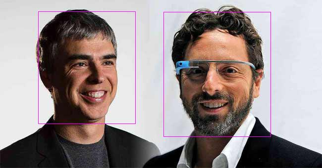

<p align="center">
  
</p>

## STILL UNDER DEVELOPMENT - DO NOT USE IN PRODUCTION

**Requires PHP 8.0+**

For feedback, please [contact me](https://form.jotform.com/201892949858375).

[](https://packagist.org/packages/ahmadmayahi/php-google-vision)
[](https://github.com/ahmadmayahi/php-google-vision/actions/workflows/run-tests.yml)
[](https://github.com/ahmadmayahi/php-google-vision/actions?query=workflow%3A"Check+%26+fix+styling"+branch%main)
[](https://packagist.org/packages/ahmadmayahi/php-google-vision)

This package provides an elegant wrapper around [Google Vision API](https://github.com/googleapis/google-cloud-php-vision)

# Contents

- [Installation](#installation)
- [Creating Google Service Account](#creating-google-service-account)
- [Configuration](#configuration)
- [Original Responses](#original-responses)
- [Integration with Laravel](#integration-with-laravel)
- [Face Detection](#face-detection)
  - [Draw box around faces](#draw-box-around-faces)
- [Image Text Detection](#image-text-detection)
  - [Get Plain Text](#get-plain-text)
  - [Get Document](#get-document)
- [Detect Image Properties](#detect-image-properties)
- [Landmark Detection](#landmark-detection)
- [Label Detection](#label-detection)

## Installation

You may install the package via composer:

```bash
composer require ahmadmayahi/php-google-vision
```

## Creating Google Service Account

First, you must [create a Google service account](https://cloud.google.com/iam/docs/creating-managing-service-accounts) and setup the configuration object as follows:

## Configuration

```php
use AhmadMayahi\GoogleVision\Config;

$config = (new Config())
    // optional
    ->setRequestTimeout(50)

    // optional: by default it uses the sys_get_temp_dir() function
    ->setTempDirPath('/path/to/temp')
    
    // Required: path to your google service account;
    ->setCredentialsPathname('path/to/google-service-account.json');
```

## Original Responses

All the features come with `getOriginalResponse()` method which returns the original response that's returned by [PHP Google Vision package](https://github.com/googleapis/google-cloud-php-vision).

You may get the original response for any feature as follows:

```php
use AhmadMayahi\GoogleVision\Vision;

$response = (new Vision($config))
    ->file(__DIR__ . '/files/google-guys.jpg')
    ->faceDetection()
    ->getOriginalResponse();
```

Depending on the feature, the response type might vary, here is a list of all the response types:

|Feature|Response Type|
|---|---|
|`detectFaces`|`Google\Protobuf\Internal\RepeatedField`|
|`detectImageText`|`Google\Protobuf\Internal\RepeatedField`|
|`detectImageProperties`|`Google\Cloud\Vision\V1\ImageProperties`|
|`detectLandmarks`|`Google\Protobuf\Internal\RepeatedField`|
|`detectSafeSearch`|`Google\Cloud\Vision\V1\SafeSearchAnnotation`|

The `file()` method accept the following type:

- Local file path: `path/to/your/file`.
- Google Storage path: `gs://path/to/file`.
- File resource, such as `fopen()`.
- `SplFileInfo`.
- `SplFileObject`.

You may also use the static `new` method to access the `Vision` class:

```php
use AhmadMayahi\GoogleVision\Vision;

$vision = Vision::new($config)
    ->file(__DIR__ . '/files/google-guys.jpg')
    ->faceDetection()
    ->getOriginalResponse();
```

## Integration with Laravel

Open up the `AppServiceProvider` and add the following lines:

```php
use AhmadMayahi\GoogleVision\Vision;
use AhmadMayahi\GoogleVision\Config;

public function register()
{
    $this->app->singleton(Vision::class, function ($app) {
        $config = (new Config())
            ->setCredentialsPathname(config('vision.service_account_path'));
    
        return new Vision($config);
    });
}
```

Using Dependency Injection:

```php
use AhmadMayahi\GoogleVision\Vision;
use Illuminate\Http\Request;

class FaceDetectionController
{
    public function detect(Request $request, Vision $vision)
    {
        $vision = $vision
            ->file($request->face_file->path())
            ->faceDetection()
            ->detect();
            
        // ...  
    }
}
```

You may also resolve the object using the `app` helper as follows:

```php
use AhmadMayahi\GoogleVision\Vision;

/** @var Vision $vision */
$vision = app(Vision::class);

$result = $vision->file('path/to/file')->faceDetection()->detect();

// ...
```

## Face Detection

The `detect` method returns a collection (`array`) of `AhmadMayahi\GoogleVision\Data\FaceData`:

```php
use AhmadMayahi\GoogleVision\Vision;

$faces = (new Vision($config))
    ->file(__DIR__ . '/files/google-guys.jpg')
    ->faceDetection()
    ->detect();

echo count($faces). ' faces found';

foreach ($faces as $faceData) {
    // How angry the face is? 
    $faceData->getAnger();
    
    // Surprise reaction? 
    $faceData->getSurprise();
    
    // Is he/she happy?
    $faceData->getJoy();
    
    // Bounds
    $faceData->getBounds();
}
```

> `getAnger`, `getSurprise` and `getJoy` return Likelihoods ratings which are expressed as 6 different values: `UNKNOWN`, `VERY_UNLIKELY`, `UNLIKELY`, `POSSIBLE`, `LIKELY`, or `VERY_LIKELY`.
> See [Likelihood](https://cloud.google.com/vision/docs/reference/rpc/google.cloud.vision.v1#likelihood).

### Draw box around faces

```php
use AhmadMayahi\GoogleVision\Vision;
use AhmadMayahi\GoogleVision\Enums\ColorEnum;

$outputFile = 'path/to/output/file.jpeg';
$color = ColorEnum::MAGENTA;

$analyzer = (new Vision($config))
    ->file(__DIR__ . '/files/google-guys.jpg')
    ->faceDetection()
    ->drawBoxAroundFaces($outputFile, $color);
```



> This feature doesn't support Google Storage yet.

## Image Text Detection

### Get plain text

The `getPlainText` returns an object of type `AhmadMayahi\GoogleVision\Data\ImageTextData`.

```php
use AhmadMayahi\GoogleVision\Vision;

$response = (new Vision($config))
    ->file(__DIR__ . '/files/my-image.jpg')
    ->imageTextDetection()
    ->getPlainText();

$response->getLocale(); // locale, for example "en" for English
$response->getText();   // Image text
```

You may also get the plain text using `__toString()`:

```php
echo $response;
```

### Get Document

The `getDocument` returns an object of type `AhmadMayahi\GoogleVision\Data\ImageTextData`.

```php
use AhmadMayahi\GoogleVision\Vision;

$response = (new Vision($config))
    ->file(__DIR__ . '/files/my-image.jpg')
    ->imageTextDetection()
    ->getDocument();
 
$response->getLocale(); // locale, for example "en" for English
$response->getText();   // Image text
```

> The difference between `getPlainText()` and `getDocuemnt()` is that the first one only retrieves the plain text (no bullets, signs, etc...), whereas the latter one tries to retrieve the entire document (including bullets, symbols, etc...).

## Image Properties Detection

The [Image Properties](https://cloud.google.com/vision/docs/detecting-properties) feature detects general attributes of the image, such as dominant color.

The `detect` method returns a collection (`array`) of `AhmadMayahi\GoogleVision\Data\ImagePropertiesData`:

```php
use AhmadMayahi\GoogleVision\Vision;

$properties = (new Vision($config))
    ->file(__DIR__ . '/files/my-image.jpg')
    ->imagePropertiesDetection()
    ->detect();

foreach ($properties as $item) {
    $item->getRed();

    $item->getBlue();

    $item->getGreen();

    $item->getPixelFraction();    
}
```

## Landmark Detection

[Landmark Detection](https://cloud.google.com/vision/docs/detecting-landmarks) detects popular natural and human-made structures within an image.

```php
use AhmadMayahi\GoogleVision\Vision;

$landmarks = (new Vision($config))
    ->file(__DIR__ . '/files/baghdad.jpg')
    ->landmarkDetection()
    ->detect();

foreach ($landmarks as $landmark) {
    $landmark->getName();
    
    // An array containing the detected locations in latitude/longitude format.
    $landmark->getLocations();
}
```

## Safe Search Detection

[SafeSearch Detection](https://cloud.google.com/vision/docs/detecting-safe-search) detects explicit content such as adult content or violent content within an image.

The `detect` method returns a collection (`array`) of `AhmadMayahi\GoogleVision\Data\SafeSearchData`:

```php
use AhmadMayahi\GoogleVision\Vision;

$result = (new Vision($config))
    ->file(__DIR__ . '/files/my-image.jpg')
    ->safeSearchDetection()
    ->detect();

$result->getAdult();

$result->getMedical();

$result->getViolence();

$result->getRacy();

$result->getSpoof();
```

## Label Detection

[Detect](https://cloud.google.com/vision/docs/labels) and extract information about entities in an image, across a broad group of categories.

The `detect` method returns an array of labels:

```php
use AhmadMayahi\GoogleVision\Vision;

$labels = (new Vision($config))
    ->file(__DIR__ . '/files/my-image.jpg')
    ->labelDetection()
    ->detect();

```

## Todo List
- [ ] Localized Object
- [ ] Logo detection
- [ ] Pdf Scanning
- [ ] Tiff Scanning
- [ ] Web
- [ ] Video-to-Text
- [ ] Speech-to-Text

## Testing

```bash
composer test
```

## Changelog

Please see [CHANGELOG](CHANGELOG.md) for more information on what has changed recently.

## Contributing

Please see [CONTRIBUTING](.github/CONTRIBUTING.md) for details.

## Security Vulnerabilities

Please review [our security policy](../../security/policy) on how to report security vulnerabilities.

## Credits

- [Ahmad Mayahi](https://github.com/ahmadmayahi)
- [All Contributors](../../contributors)

## License

The MIT License (MIT). Please see [License File](LICENSE.md) for more information.
